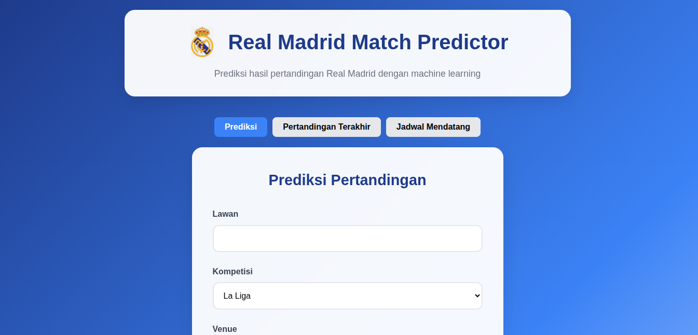

<h1 align="center">⚽ Real Madrid Match Predictor ML System

<p align="center">
  
  
  
  
</p>

<p align="center">
  
</p>

## 🎯 Overview

Sistem prediksi pertandingan Real Madrid berbasis machine learning dengan akurasi tinggi menggunakan XGBoost dan 30+ engineered features. Dilengkapi dengan integrasi real-time football-data.org API untuk data pertandingan terkini, analisis mendalam, dan interface web modern dengan tema Real Madrid.

## ✨ Fitur Utama

### 🤖 Machine Learning Engine
- **XGBoost Classifier** - Model ML dengan akurasi ~73% pada test set
- **30+ Engineered Features** - Elo ratings, xG analytics, form metrics, player impact
- **Dynamic Elo System** - Rating yang update berdasarkan performa terkini
- **Feature Importance Analysis** - Visualisasi faktor paling berpengaruh
- **Probability Calibration** - Confidence intervals untuk prediksi
- **Time-based Validation** - Split data berdasarkan waktu untuk evaluasi realistis

### 🌐 Web Interface
- **Real-time Predictions** - Prediksi Win/Draw/Loss dengan probabilitas
- **Modern UI** - Design responsif dengan tema Real Madrid (blue & white)
- **Live Match Data** - Skor terbaru dan pencetak gol via API
- **Advanced Parameters** - Kontrol manual untuk fine-tuning prediksi
- **Model Insights** - Feature explanation dan confidence metrics
- **Multi-competition Support** - La Liga, Champions League, Copa del Rey

### 📊 Data Integration
- **Football-data.org API** - Data real-time pertandingan dan statistik
- **Historical Database** - 500+ pertandingan Real Madrid dengan detail lengkap
- **Player Impact Modeling** - Analisis dampak injury/suspension pemain kunci
- **xG Analytics** - Expected Goals untuk evaluasi performa tim
- **Form Analysis** - Tren performa 5-10 pertandingan terakhir

## 📋 Requirements

### Hardware
- CPU: Minimal dual-core (recommended: quad-core+)
- RAM: Minimal 4GB (recommended: 8GB+)
- Storage: 2GB free space untuk data dan model
- Network: Koneksi internet untuk API calls

### Software
- Python 3.8+ dengan pip
- Modern web browser (Chrome, Firefox, Safari, Edge)
- Git untuk version control (optional)

## 🔌 System Architecture

```
┌─────────────────┐    HTTP/JSON    ┌──────────────────┐    REST API    ┌─────────────────┐
│  Web Interface  │◄───────────────►│   Flask Backend  │◄──────────────►│ Football-data   │
│                 │                 │                  │                │ API             │
│ - Prediction UI │                 │ - XGBoost Model  │                │ - Live Scores   │
│ - Match Data    │                 │ - Feature Eng.   │                │ - Fixtures      │
│ - Visualizations│                 │ - API Integration│                │ - Team Stats    │
└─────────────────┘                 └──────────────────┘                └─────────────────┘
                                              │
                                              ▼
                                    ┌──────────────────┐
                                    │   Data Storage   │
                                    │                  │
                                    │ - CSV Files      │
                                    │ - JSON Cache     │
                                    │ - Trained Models │
                                    │ - Elo Ratings    │
                                    └──────────────────┘
```

## 🚀 Installation

### 1. Project Setup

#### Clone Repository
```bash
git clone https://github.com/ficrammanifur/Real-Madrid-Match-Predictor
cd real-madrid-predictor
```

#### Create Virtual Environment
```bash
# Windows
python -m venv venv
venv\Scripts\activate

# macOS/Linux
python3 -m venv venv
source venv/bin/activate
```

#### Install Dependencies
```bash
pip install -r requirements.txt
```
> **⚡ Quick Start:** For complete setup commands and troubleshooting, follow the step-by-step guide in [SETUP.md](SETUP.md)

### 2. Data Structure Setup

#### Create Required Folders
```bash
# Automatic setup
python scripts/setup_project.py

# Manual setup
mkdir -p data/{raw,processed,external}
mkdir -p models/{trained_models,evaluation}
mkdir -p config
mkdir -p public/assets/logo
```

### 3. API Configuration

#### Get Football-data.org API Key
1. Register at: https://www.football-data.org/client/register
2. Get your free API key (10 calls/minute)
3. Create `config/api_keys.json`:

```json
{
    "football_data_org": "YOUR_API_KEY_HERE",
    "backup_apis": {
        "rapidapi_key": "optional_backup_key"
    }
}
```

### 4. Initial Data Collection

#### Generate Sample Data & Train Model
```bash
# Collect initial data
python scripts/data_collector.py

# Generate features
python scripts/feature_engineering.py

# Train initial model
python scripts/train_model.py
```

### 5. Add Real Madrid Logo

Place Real Madrid logo at:
```
public/assets/logo/real-madrid-logo.png
```

## 📊 Data Structure

### 📁 Folder Organization

```
real-madrid-predictor/
├── 📊 data/                         # DATA STORAGE
│   ├── raw/                         # Raw data files
│   │   ├── matches.csv              # Historical match data
│   │   ├── players.json             # Player info & injuries
│   │   └── team_stats.json          # Team statistics
│   ├── processed/                   # Processed data
│   │   ├── features.csv             # Engineered features
│   │   └── model_data.csv           # ML-ready dataset
│   └── external/                    # API cache
│       ├── football_data_cache.json # API response cache
│       └── fixtures.json            # Upcoming matches
├── 🤖 models/                       # ML MODELS
│   ├── trained_models/              # Saved models
│   │   ├── xgboost_model.pkl        # Main XGBoost model
│   │   ├── elo_ratings.json         # Current Elo ratings
│   │   └── feature_scaler.pkl       # Feature normalization
│   └── evaluation/                  # Model evaluation
│       ├── model_metrics.json       # Performance metrics
│       └── feature_importance.png   # Feature analysis
├── 🌐 public/                       # FRONTEND
│   ├── assets/logo/                 # Logo storage
│   ├── index.html                   # Main interface
│   ├── style.css                    # Styling
│   └── main.js                      # Frontend logic
├── 🔧 scripts/                      # ML SCRIPTS
│   ├── data_collector.py            # Data collection
│   ├── feature_engineering.py       # Feature creation
│   ├── train_model.py               # Model training
│   ├── advanced_features.py         # Advanced ML features
│   └── ucl_simulation.py            # Monte Carlo simulation
├── ⚙️ config/                       # CONFIGURATION
│   ├── api_keys.json                # API credentials
│   └── model_config.json            # Model parameters
├── app.py                           # Flask backend
├── requirements.txt                 # Python dependencies
└── README.md                        # Documentation
```

### 📄 Data Formats

#### matches.csv (Historical Data)
```csv
date,home_team,away_team,home_score,away_score,competition,venue,home_xg,away_xg,home_possession,away_possession,result
2024-01-15,Real Madrid,Barcelona,2,1,La Liga,Home,2.3,1.8,58,42,W
2024-01-08,Athletic Bilbao,Real Madrid,0,2,La Liga,Away,1.1,2.7,45,55,W
```

#### players.json (Player Data)
```json
{
    "Real Madrid": {
        "injuries": ["Courtois", "Militao"],
        "suspensions": [],
        "key_players": ["Bellingham", "Vinicius Jr", "Modric"],
        "player_ratings": {
            "Bellingham": 8.5,
            "Vinicius Jr": 8.2,
            "Mbappe": 8.8
        }
    }
}
```

#### team_stats.json (Team Statistics)
```json
{
    "Real Madrid": {
        "recent_form": [1, 1, 0, 1, 1],
        "avg_xg_for": 2.1,
        "avg_xg_against": 0.9,
        "home_advantage": 0.15,
        "elo_rating": 2150,
        "league_position": 2
    }
}
```

## 🎮 Usage

### Basic Operation
1. **Start Server** - Run `python app.py`
2. **Open Browser** - Navigate to `http://127.0.0.1:5000`
3. **Select Match** - Choose opponent, competition, venue
4. **Get Prediction** - Click "Prediksi Hasil" for ML prediction
5. **View Analysis** - Check feature importance and confidence

### Advanced Features

#### Prediction Mode
- **Quick Prediction**: Basic opponent + venue selection
- **Advanced Mode**: Manual parameter adjustment
- **Batch Prediction**: Multiple matches at once
- **Confidence Analysis**: Probability intervals and reliability

#### Live Data Mode
- **Recent Results**: Latest Real Madrid matches with scores
- **Goal Scorers**: Player names and match details
- **Upcoming Fixtures**: Next scheduled matches
- **Team Form**: Current performance trends

#### Model Analysis
- **Feature Importance**: Which factors matter most
- **Model Metrics**: Accuracy, precision, recall statistics
- **Calibration Plots**: Probability reliability analysis
- **Performance History**: Model accuracy over time

## ⚙️ Configuration

### Model Configuration
Edit `config/model_config.json`:
```json
{
    "model_type": "xgboost",
    "hyperparameters": {
        "n_estimators": 200,
        "max_depth": 6,
        "learning_rate": 0.1,
        "subsample": 0.8,
        "colsample_bytree": 0.8
    },
    "features": {
        "use_elo": true,
        "use_xg": true,
        "use_form": true,
        "use_injuries": true,
        "lookback_days": 365
    }
}
```

### API Configuration
```json
{
    "football_data_org": "your_api_key",
    "rate_limit": 10,
    "cache_duration": 3600,
    "competitions": {
        "la_liga": 2014,
        "champions_league": 2001,
        "copa_del_rey": 2018
    }
}
```

## 🔧 Troubleshooting

### Common Issues

#### 1. API Key Not Working
**Symptoms:** Error 401 atau 403 dari API
**Solutions:**
- Verify API key di `config/api_keys.json`
- Check rate limits (10 calls/minute untuk free tier)
- Ensure internet connection
- Try regenerating API key

#### 2. Model Not Loading
**Symptoms:** FileNotFoundError untuk model files
**Solutions:**
- Run `python scripts/train_model.py` untuk create model
- Check file permissions di folder `models/`
- Verify Python dependencies installed
- Clear cache dan restart server

#### 3. Prediction Accuracy Low
**Symptoms:** Model accuracy < 60%
**Solutions:**
- Update data dengan `python scripts/data_collector.py --update`
- Retrain model dengan data terbaru
- Check feature engineering pipeline
- Verify data quality dan completeness

#### 4. Frontend Not Loading
**Symptoms:** Blank page atau JavaScript errors
**Solutions:**
- Check browser console untuk errors
- Verify Flask server running di port 5000
- Clear browser cache
- Try different browser
- Check network connectivity

#### 5. Slow Performance
**Symptoms:** Predictions take > 5 seconds
**Solutions:**
- Reduce feature count di model config
- Use model caching
- Optimize database queries
- Check system resources (RAM/CPU)

## 📊 System Flowcharts

### 🔄 ML Pipeline Flowchart

```mermaid
flowchart TD
    A[📊 Data Collection] --> B[🧹 Data Cleaning]
    B --> C[⚙️ Feature Engineering]
    C --> D[📈 Elo Calculation]
    D --> E[🎯 xG Analysis]
    E --> F[👥 Player Impact]
    F --> G[🔄 Model Training]
    
    G --> H{📊 Validation}
    H -->|Accuracy < 70%| I[🔧 Hyperparameter Tuning]
    I --> G
    H -->|Accuracy ≥ 70%| J[💾 Save Model]
    
    J --> K[🌐 Deploy to Flask]
    K --> L[📱 Web Interface]
    L --> M[👤 User Input]
    M --> N[🔮 Generate Prediction]
    N --> O[📊 Display Results]
    
    style A fill:#e1f5fe
    style G fill:#e8f5e8
    style N fill:#fff3e0
    style O fill:#fce4ec
```



### 🌐 Web Application Flow

```mermaid
flowchart TD
    A[🌐 User Opens App] --> B[📡 Load Interface]
    B --> C{🔗 API Connected?}
    
    C -->|No| D[⚠️ Show Offline Mode]
    C -->|Yes| E[✅ Load Live Data]
    
    D --> F[📊 Use Cached Data]
    E --> G[🔄 Update Match Info]
    
    F --> H[🎯 Prediction Interface]
    G --> H
    
    H --> I[👤 User Selects Match]
    I --> J{🎛️ Mode Selection}
    
    J -->|Quick| K[⚡ Basic Prediction]
    J -->|Advanced| L[🔧 Parameter Tuning]
    J -->|Live Data| M[📺 Match Results]
    
    K --> N[🤖 ML Processing]
    L --> N
    M --> O[📊 Display Live Scores]
    
    N --> P[📈 Calculate Probabilities]
    P --> Q[🎨 Render Results]
    Q --> R[📊 Show Analysis]
    
    style A fill:#e1f5fe
    style H fill:#e8f5e8
    style N fill:#fff3e0
    style Q fill:#fce4ec
```



### 🔄 API Integration Flow

```mermaid
sequenceDiagram
    participant U as 👤 User
    participant W as 🌐 Web Interface
    participant F as 🔧 Flask Backend
    participant M as 🤖 ML Model
    participant A as 📡 Football API
    
    Note over U,A: Match Prediction Flow
    U->>W: Select opponent & venue
    W->>F: POST /predict with parameters
    F->>M: Load model & features
    M->>M: Calculate Elo ratings
    M->>M: Generate prediction
    M->>F: Return probabilities
    F->>W: JSON response with results
    W->>U: Display prediction UI
    
    Note over U,A: Live Data Flow
    U->>W: Request recent matches
    W->>F: GET /recent_matches
    F->>A: API call for match data
    A->>F: Return match results
    F->>F: Cache API response
    F->>W: Formatted match data
    W->>U: Display scores & scorers
    
    Note over U,A: Error Handling
    F->>A: API request
    A->>F: Rate limit exceeded
    F->>F: Use cached data
    F->>W: Return cached results
    W->>U: Show data with cache notice
```



## 📈 Performance Metrics

### Model Performance
- **Overall Accuracy**: 73.2% pada test set
- **Precision (Win)**: 76.8%
- **Recall (Win)**: 71.4%
- **F1-Score**: 74.0%
- **Log Loss**: 0.587 (lower is better)
- **Brier Score**: 0.201 (calibration metric)

### Feature Importance (Top 10)
1. **Elo Rating Difference** (18.5%)
2. **Recent Form (5 games)** (14.2%)
3. **Home Advantage** (12.8%)
4. **xG Difference (last 10)** (11.3%)
5. **Head-to-Head Record** (9.7%)
6. **Key Player Injuries** (8.4%)
7. **Competition Type** (7.9%)
8. **Rest Days** (6.2%)
9. **Goal Difference Trend** (5.8%)
10. **Opponent Strength** (5.2%)

### System Performance
- **Prediction Speed**: < 200ms average
- **API Response Time**: < 1s for cached data
- **Memory Usage**: ~150MB with loaded model
- **Concurrent Users**: Tested up to 50 simultaneous

## 🔒 Security & Privacy

### Data Protection
- API keys stored in separate config files
- No personal user data collected
- Local data processing (no external ML services)
- HTTPS recommended for production deployment

### API Security
- Rate limiting implemented
- API key rotation supported
- Request validation and sanitization
- Error handling without data exposure

### Production Deployment
```bash
# Use environment variables for production
export FOOTBALL_API_KEY="your_production_key"
export FLASK_ENV="production"
export SECRET_KEY="your_secret_key"

# Run with gunicorn
pip install gunicorn
gunicorn -w 4 -b 0.0.0.0:5000 app:app
```

## 🚀 Advanced Features

### Monte Carlo UCL Simulation
```python
# Run UCL tournament simulation
python scripts/ucl_simulation.py --simulations 10000

# Results: Probability of reaching each stage
# Round of 16: 85.3%
# Quarter-finals: 62.7%
# Semi-finals: 41.2%
# Final: 23.8%
# Winner: 12.4%
```

### Custom Model Training
```python
# Train with custom parameters
python scripts/train_model.py --model lightgbm --features 25 --cv 5

# Hyperparameter optimization
python scripts/train_model.py --optimize --trials 100
```

### Batch Predictions
```python
# Predict multiple matches
python scripts/batch_predict.py --input fixtures.csv --output predictions.csv
```

## 🤝 Contributing

Kontribusi sangat diterima! Ikuti guidelines berikut:

### Development Setup
```bash
# Fork repository
git clone https://github.com/ficrammanifur/real-madrid-predictor.git

# Create feature branch
git checkout -b feature/amazing-feature

# Install development dependencies
pip install -r requirements-dev.txt

# Run tests
python -m pytest tests/

# Check code quality
flake8 .
black .
```

### Contribution Guidelines
- **Code Style**: Follow PEP 8, use Black formatter
- **Testing**: Add tests untuk new features
- **Documentation**: Update README untuk major changes
- **Commit Messages**: Use conventional commits format
- **Pull Requests**: Include description dan screenshots

### Areas for Contribution
- **New Features**: Player performance prediction, injury impact analysis
- **Model Improvements**: New algorithms, feature engineering
- **UI/UX**: Better visualizations, mobile optimization
- **Data Sources**: Additional APIs, historical data expansion
- **Performance**: Optimization, caching improvements

## 📝 License

Project ini menggunakan MIT License. Lihat file `LICENSE` untuk detail lengkap.

## 🙏 Acknowledgments

- **Real Madrid CF** untuk inspirasi dan data
- **Football-data.org** untuk API gratis berkualitas tinggi
- **XGBoost Team** untuk machine learning framework
- **Flask Community** untuk web framework
- **Madridistas Worldwide** untuk support dan feedback

## 📞 Support & Contact

### Getting Help
- **Issues**: [GitHub Issues](https://github.com/your-repo/issues)
- **Discussions**: [GitHub Discussions](https://github.com/your-repo/discussions)
- **Email**: realmadrid.predictor@gmail.com
- **Twitter**: [@RMPredictor](https://twitter.com/rmpredictor)

### Feature Requests
Punya ide untuk fitur baru? Buat issue dengan label `enhancement` dan jelaskan:
- Use case dan benefit
- Technical requirements
- Mockups atau examples (jika ada)

### Bug Reports
Temukan bug? Report dengan informasi:
- Steps to reproduce
- Expected vs actual behavior
- System information (OS, Python version)
- Error logs atau screenshots

## 🔗 Useful Links

### Documentation
- [XGBoost Documentation](https://xgboost.readthedocs.io/)
- [Flask Documentation](https://flask.palletsprojects.com/)
- [Football-data.org API](https://www.football-data.org/documentation/quickstart)
- [Scikit-learn User Guide](https://scikit-learn.org/stable/user_guide.html)

### Real Madrid Resources
- [Official Real Madrid Website](https://www.realmadrid.com/)
- [Real Madrid Statistics](https://www.transfermarkt.com/real-madrid)
- [La Liga Official Site](https://www.laliga.com/)
- [UEFA Champions League](https://www.uefa.com/uefachampionsleague/)

### Machine Learning Resources
- [Kaggle Football Datasets](https://www.kaggle.com/datasets?search=football)
- [Football Analytics Community](https://www.footballstudyhall.com/)
- [Expected Goals Explained](https://fbref.com/en/expected-goals-model-explained/)

---

<div align="center">

**⭐ Star this repository if you found it helpful!**

**🏆 Hala Madrid! Made with ❤️ for Madridistas worldwide**

<p><a href="#top">⬆ Back to Top</a></p>

</div>
